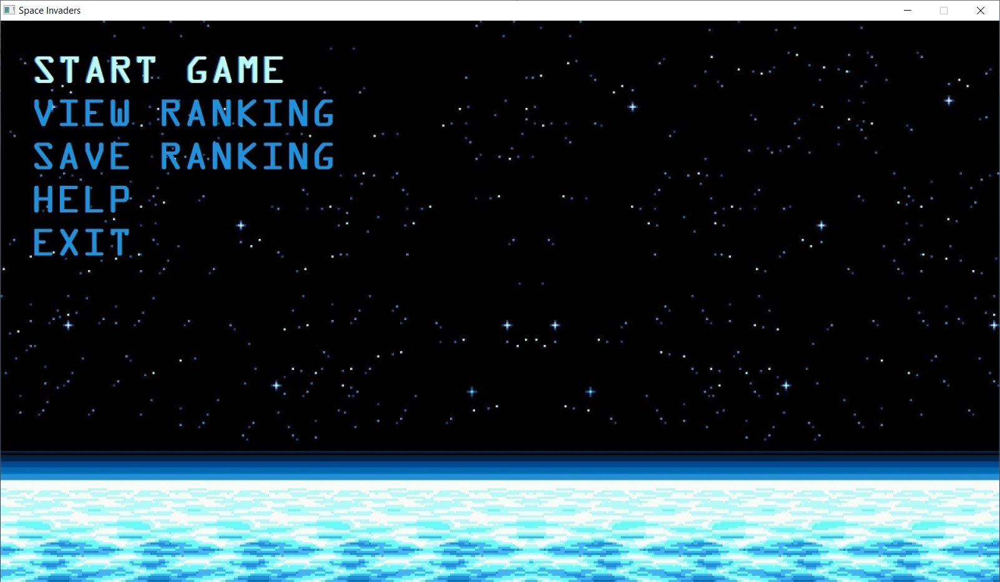
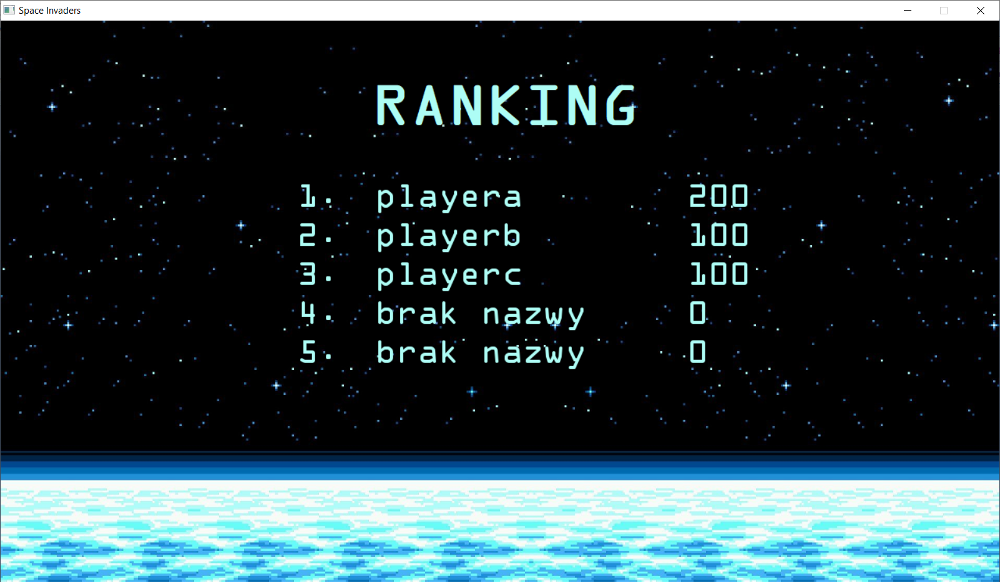
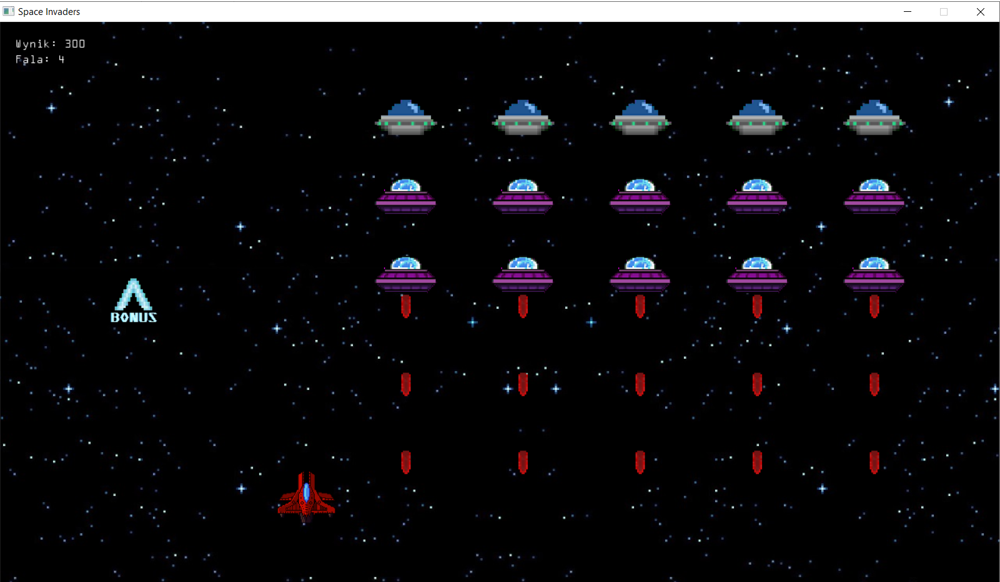
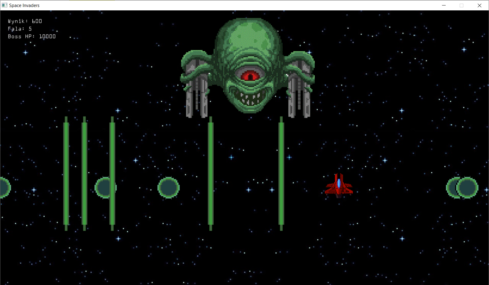

# SpaceShooter
My second 2D game inspired by Space Invaders. Game developed in 2021.

## Technologies Used
- C++ language
- Allegro 5.0.10 library - game engine

## Example Screenshots
### Menu

### Ranking

### Gameplay

### Boss

## Installation

Allegro 5 library needs to be installed before starting the application. It can be downloaded from [authors site.](https://liballeg.org/)

## Contribution
### Assets
- Boss - William Robinson [source](https://www.artstation.com/artwork/ARKZX/)
- Background - charligodd [source](https://wall.alphacoders.com/big.php?i=885542)
- Player space ship - Tummyache, a1 [source](https://opengameart.org/content/purple-space-ship)
- Others
### Inspiration
- Space Invaders
